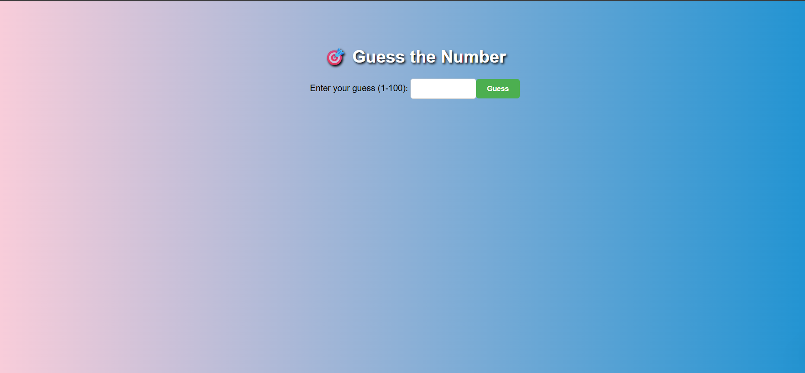
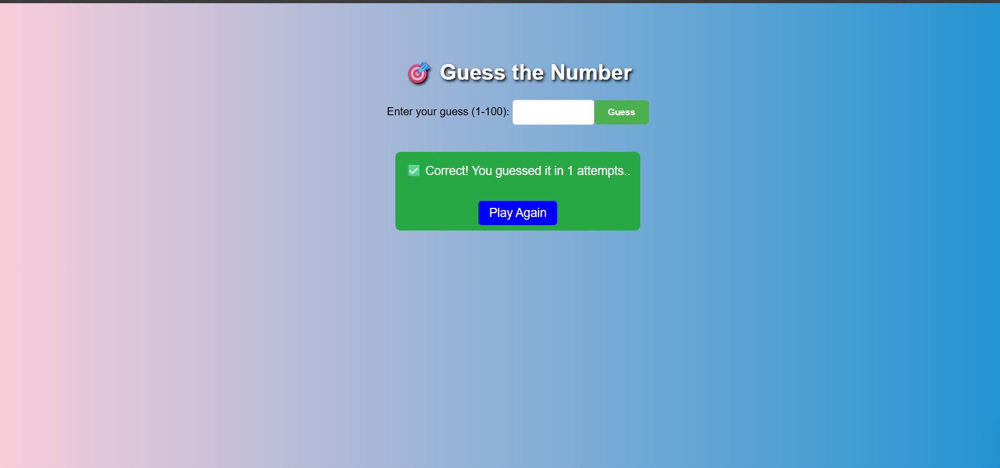
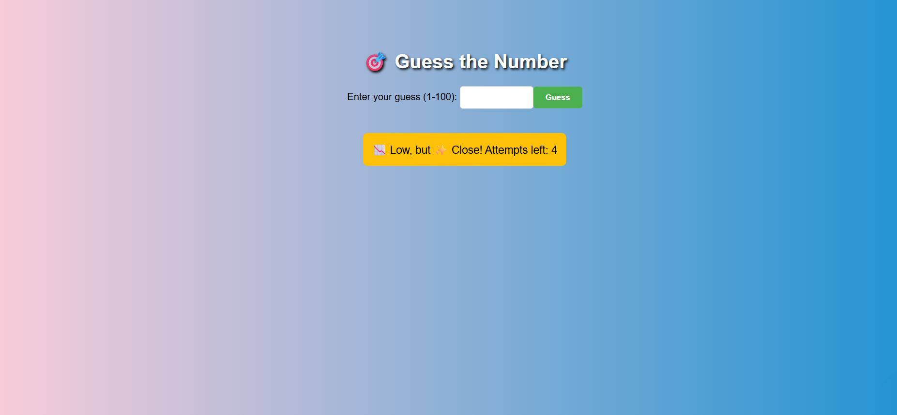
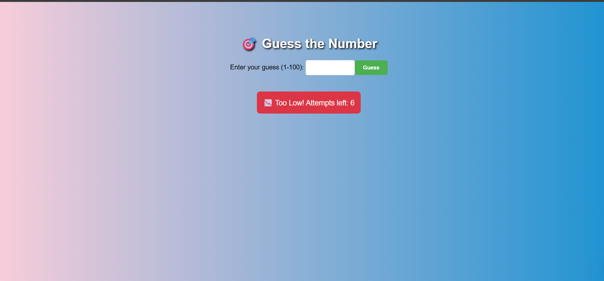
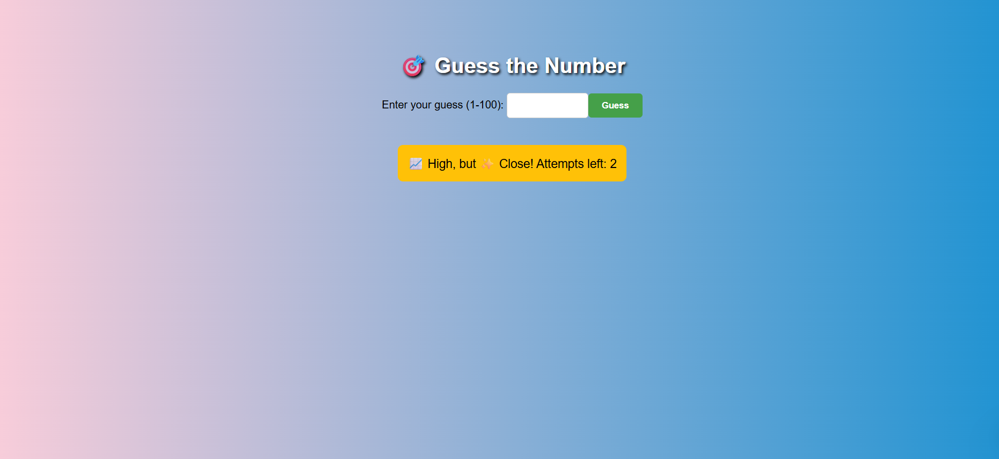
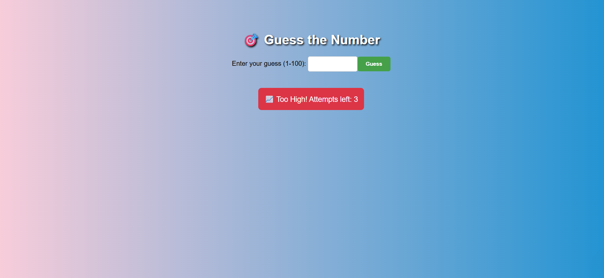
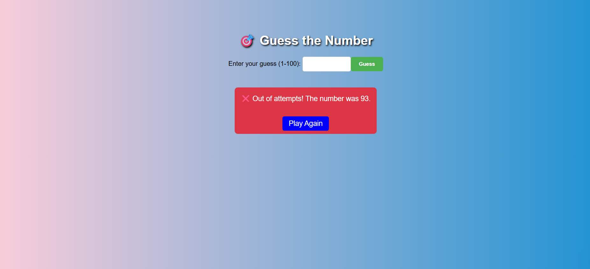

# OIBSIP_Java-Development_task2
# 🎯 Guess The Number - Java HTTP Server Game

A fun, interactive **Guess the Number** game built in **Java** using the `com.sun.net.httpserver.HttpServer` class.  
This project runs as a local HTTP server and lets players guess a randomly chosen number between **1 and 100** via a simple web interface.

---

## 🚀 Features
- 🎮 **Interactive Web Interface** – Guess directly in your browser.
- 🔀 **Random Secret Number** every game.
- 💡 **Hints & Closeness Indicator** – Know if you are very close, close, or far from the number.
- ⏳ **Limited Attempts** – You have only 7 chances to guess correctly.
- 🌈 **Styled UI** – Simple yet colorful design with gradients and buttons.
- 🔄 **Auto Reset** after winning or losing.

---

## 🖥 How It Works
1. When the server starts, it generates a secret number between **1 and 100**.
2. The user opens `http://localhost:8080` in a browser.
3. The user guesses the number via the form.
4. The server responds with:
   - ✅ **Correct!** if guessed right.
   - 📉 **Too Low** or 📈 **Too High** with closeness hints.
   - ❌ **Out of Attempts** when max tries are reached.
5. The game automatically resets after a win or loss.

#Working Of program
https://youtu.be/6HMK7anN_mc?si=DwmDboRzdMOUx9qx

#Screenshots
#HomePage

#Correct Guess

#Low Guess - Very Close

#Low - Close 

#Too Low Guess

#High Guess - Very Close

#High Guess - Close

#Too High Guess

#Wrong Guess
